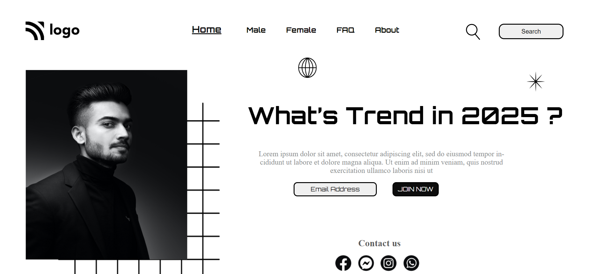

# **PROJECT1 - Street Style Landing Page**

- ## _`: By Sayali Patil`_

**[Click here](https://street-style-landing-saya.netlify.app/) for the live demo of the webspage on [Netlify](https://www.netlify.com/).**

## Key Features

- **Street Style Landing Page** is THE sample webpage which is Designed with HTML5 and CSS-3.
- ### Font Used -
  - Orbitron
  - Kantumruy Pro
- Icons are used from _Font Awesome_
- The website is hosted on _Netlify_.
- The _search button_ is made transparent

## Emailware

- It's an emailware. Meaning, if you lik this sample wepage template or it has helped you in any way, I'd like you send me an email at *sayalipatil5629@gmail.com* about anything you'd want to say about this project.. I'd really appreciate it!

## Completion Time

- 3 Hours

## Credits

- The project is a part of the learning from **_Full Stack Javascript Bootcamp_** course by **_iNeuron_**. Credit for the idea is his. I understood the concepts and learned them by building them myself with minimal reference to the source code. The method of execution is modified according to my point of view, whenever necessary.
